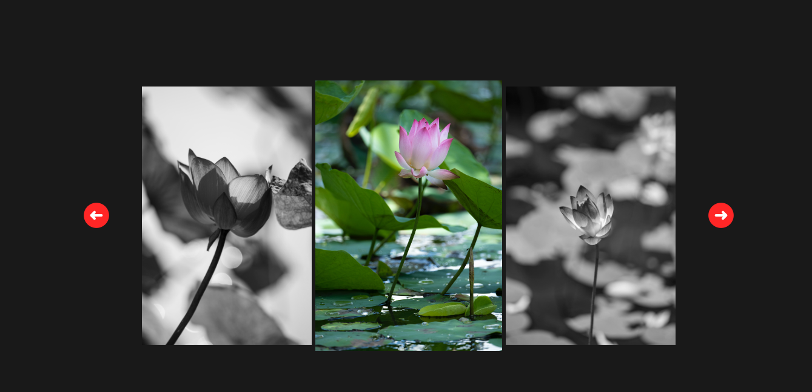

# Image Gallery

This project demonstrates how to create an image gallery in HTML, CSS, and JavaScript.


## Getting Started

To run the project, clone the repository and open it in a web browser.

```bash
  git clone https://github.com/DeepakKumarVermaRamgarh/ImageGallary
```
    
## Features

The image gallery allows you to:

- Add images to the gallery.
- View the images in a grid or a list.
- Zoom in and out of the images.


## Usage/Examples

To use the image gallery, open the index.html file in a web browser. You can then add images to the gallery by editing the file. You can also change the appearance of the gallery by editing the styles.css file.


## Roadmap

Here is a brief overview of each file in the repository:

- index.html - This file contains the HTML code for the project.

- styles.css - This file contains the CSS code that styles the image gallery.

- script.js - This file contains the JavaScript code that defines the image gallery.

- README.md - This file provides instructions on how to run the project.
## Authors

This project was created by Deepak Kumar Verma.
- [@DeepakKumarVermaRamgarh](https://github.com/DeepakKumarVermaRamgarh/)


## Screenshots


